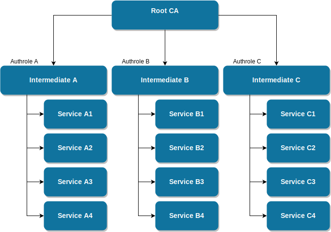

# autobahnkreuz [](https://github.com/EmbeddedEnterprises/autobahnkreuz/releases) [](https://goreportcard.com/report/github.com/EmbeddedEnterprises/autobahnkreuz) [](https://godoc.org/github.com/EmbeddedEnterprises/autobahnkreuz) [](https://hub.docker.com/r/embeddedenterprises/autobahnkreuz/) [](https://hub.docker.com/r/embeddedenterprises/autobahnkreuz/builds/) [](https://hub.docker.com/r/embeddedenterprises/autobahnkreuz/)  [](https://liberapay.com/EmbeddedEnterprises/donate)


An advanced wamp router based on nexus.

## About this project

There are multiple wamp routers available off the shelf, we evaluated many of them
but nothing fitted our requirements, so we decided to create our own router.

The name is deducted from the client libraries such as autobahn.js and autobahn|cpp.

Currently there is a lack of documentation, but we are working to fix this.

## Installation

### Docker

[Docker Hub](https://hub.docker.com/r/embeddedenterprises/autobahnkreuz/)

You can easily get an docker image on your machine.  
`docker pull embeddedenterprises/autobahnkreuz:edge`

You can start and get the help page from this image with the following command.  
`docker run -it embeddedenterprises/autobahnkreuz:edge --help`

Afterwards you can enter your configuration parameters. The entire router does not save state to the container or to mounted volumes.

### Local

It is necessary to have a working go installation on your system.  

`git clone https://github.com/EmbeddedEnterprises/autobahnkreuz/` clones the project to your current folder.
After entering the `autobahnkreuz` folder, you can use `go run main.go` to start `autobahnkreuz`.
To configure the instance, you can append your configuration parameters to the command, e.g. `go run main.go -h`

### Build Your Own Containers

It is also possible to build your own container.

**Notice**: Don't use the `Dockerfile`. This is meant to build the docker images. It clones the git repository and don't use your local files.  

**Notice**: You need to rename or remove the `.dockerignore` file. `.dockerignore` ignores everything due to several CI reasons. We are sorry about this.

`docker build -t autobahnkreuz:test -f DockerfileLocal .` will build the docker image.

## Configuration

To allow `autobahnkreuz` to run, at least a realm has to be specified. This is done using `--realm` or `-r` and has to be a valid URI.
Based on your requirements, more flags may be needed which are described below.

### Endpoint Configuration

`autobahnkreuz` can listen on two endpoints simultaneously.
Currently, **one** websocket endpoint **and one** websocket-over-TLS endpoint is supported. This may be expanded lateron.

Both endpoints are enabled by default and can be configured using the following parameters:

| CLI Parameter   | Type   |  Default Value | Description |
| --------------- | ------ | -------------- | ----------- |
| --ws-host       | string | 0.0.0.0        | Listen address for the WebSocket endpoint |
| --ws-port       | uint16 | 8001           | Port for the WebSocket endpoint |
| --wss-cert-file | string | nil            | TLS Cert file  |
| --wss-host      | string | 0.0.0.0        | Listen address for the TLS endpoint |
| --wss-key-file  | string | nil            | TLS Key file |
| --wss-port      | uint16 | 8000           | Port for the TLS endpoint |

To use the WS-over-TLS endpoint, a certificate pair has to be set, which is done using `--wss-cert-file` for the public key and `--wss-key-file` for the private key.
At the moment, no live-reload of certificates is supported, so to use new certificates you have to restart `autobahnkreuz`.

#### Background

The TLS endpoint also supports TLS client authentication, which can be used to create sophisticated authentication and authorization structures easily.
The intention is to have the TLS endpoint exposed to the inner application (your **backend**) and to have the WS endpoint exposed to your end users via a reverse proxy like nginx (which also serves the files for your **frontend**) which further separates TLS termination away from `autobahnkreuz` to your cloud provider/environment. The separation between TLS for internal usage and WS for external usage also yields a better privilege separation and therefore improves application security.

### Logging Configuration
Configuration of the `autobahnkreuz` Logger is supported by setting following environment variables:

#### `SERVICE_LOGFORMAT`

This allows setting the formatting of the Logger out of a set of predefined Formats:

- `human`, or `debug`

`%{color}[%{level:-8s}] %{time:15:04:05.000} %{longpkg}@%{shortfile}%{color:reset} -- %{message}`

- `k8s`, `cluster`, or `machine`

`[%{level:-8s}] %{time:2006-01-02T15:04:05.000} %{shortfunc} -- %{message}`

Will default to `human` if none is set, and exit if the set value is not recognized.

#### `SERVICE_LOGLEVEL`

This allows setting the depth which the Logger will display at maximum. Values are defined as:

- `CRITICAL`
- `ERROR`  
- `WARN`  
- `INFO`  
- `DEBUG`  

If no variable is set or the value is invalid, `autobahnkreuz` will default to `INFO`.

### Authentication

`autobahnkreuz` provides advanced authentication facilities used to authenticate end users and backend services. At the moment, there are four authentication methods supported:

- `anonymous`
- `ticket`
- `resume-token`
- `tls client auth`

#### Anonymous

Anonymous authentication is granted whenever a client connects and specifies anonymous as authmethod. The intention to provide anonymous authentication is to provide the possibility for non-user-dependent endpoints, such as user registration and so on. This is done to eliminate the need for two API endpoints (like REST and WAMP).

The authrole granted to anonymous users can be specified using the `--anonymous-authrole` command line switch.


| Command Line Switch  | Type   |  Default Value | Description |
| -------------------- | ------ | -------------- | ----------- |
| --anonymous-authrole | string | anonymous      | Authentication role to assign to anonymous clients |
| --enable-anonymous   | bool   | true           | Whether to allow authmethod 'anonymous' |

#### Ticket/Resume-Token

Ticket authentication should be used by end users of your **frontend** to log-in to your application. When logging in via `ticket` method, a resume token can be generated as well.
Resume tokens are valid for 1 week (we plan to make it configurable as well). Resume tokens are stored in memory within the router, so they are gone when the router restarts.

To use `ticket` authentication, the user of `autobahnkreuz` has to specify a WAMP endpoint, which checks whether the ticket (i.e. password) is vaild for the user trying to login.
This procedure has to be specified using the `--ticket-check-func` command line switch. The ticket check function needs to have the following signature:

```ts
// return nothing when the ticket is correct, otherwise throw/generate an error.
function checkTicket(realm: string, authid: string, ticket: string): void;
```

Both `ticket` and `resume-token` authmethods require a function mapping an authid (i.e. username) to its corresponding authroles. This function is a WAMP endpoint and has to be specified using the `--ticket-get-role-func` command line switch. The get-role-func needs to have the following signature:

```ts
// To use this endpoint in autobahn.js, return an autobahn.Result! (see their documentation for reference)
type IAuthExtra = {
  authroles: string[],
  [key: string]?: any,
}
function getRoles(realm: string, authid: string): [string[] | IAuthExtra, any?]
```

The first return value may be a simple list of authroles to assign to the user, optionally, the implementer may return a dictionary or javascript object
which is then used as `authextra` field within the WAMP `Welcome` message. However, when returning a dictionary, the `authroles` field is mandatory.

Additionally, the implementer may return a **second** value which is used as `DETAILS` field in the `WELCOME` message.
This is reserved functionality for very specific use cases.

The authroles returned by the get-roles endpoint are filtered within `autobahnkreuz` against the blacklist given in the `--exclude-auth-role` command line switch to ensure no privileged authroles are issued to end users.

| Command Line Switch    | Type     |  Default Value | Description |
| ---------------------- | -------- | -------------- | ----------- |
| --enable-resume-token  | bool     | true           | Whether to allow ticket authentication to have a keep-me-logged-in token. |
| --enable-ticket        | bool     | true           | Whether to allow authmethod 'ticket' |
| --ticket-check-func    | string   | nil            | Which WAMP RPC to call when ticket authentication is requested |
| --ticket-get-role-func | string   | nil            | Which WAMP RPC to call to resolve authid to authrole/authextra |
| --exclude-auth-role    | string[] | nil            | Authentication roles to exclude from ticket authentication |

#### TLS Client Authentication

When connecting via TLS, there is the possibility to use a [PKI](https://en.wikipedia.org/wiki/Public_key_infrastructure) to authenticate clients (i.e. **backend** services).
The TLS endpoint can be configured (using `--wss-client-auth`) to either ignore provided client certificates (value of `no`), accept and check them (`accept`, default) or require valid client certificates and close the connection when none are provided (`require`).

After the user decides for a TLS authentication strategy, he can provide CA certificates and assign authroles.

A scenario like the following can be configured easily using:



`--wss-client-auth=require --wss-client-ca=role-a;/a.pem,role-b;/b.pem,role-c;/c.pem`, assuming your certs are `/[a-c].pem` and you want to assign `role-[a-c]`

We recommend the awesome [EasyPKI](https://github.com/google/easypki) project to manage your certificates.

### Authorization

`autobahnkreuz` provides two different ways to authorize WAMP actions:

- Dynamic authorization using a provided WAMP endpoint
- Authorization based on a feature matrix (**alpha state, not production ready**)

You can only use multiple authorization methods, by default, this is only the dynamic authorization.

If you use multiple authentication methods, you may want to choose an consent mode. By default, every authorizer needs to
give consent to an call. You also have the opportunity to choose the `one` consent mode, 
where only one authorizer needs to give consent to an call.

| CLI Parameter                     | Type      | Default Value  | Description |
| --------------------------------- | --------- | -------------- | ----------- |
| --consent-mode                    | string    | all            | Whether to need one or multiple consents per call (values: 'all', 'one') |


#### Dynamic Authorization

Dynamic authorization calls a WAMP endpoint for each action which has to be authorized. It is enabled by default and can be disabled via the `--enable-authorization` flag. For dynamic authorization to work, the user has to provide a WAMP RPC which is called every time an action has to be authorized in the `--authorizer-func` parameter.

The dynamic authorizer has a fallback value, which is used whenever the authorization function is not available or generates an error, the default value is to reject any actions, but it can be configured to permit any actions. (`--authorizer-fallback`)

To reduce load on the authorization endpoint, a **fast-path** checking can be enabled directly within autobahnkreuz. You can pass a list of `trusted` authroles to the authorizer, which means that for any action of those authroles, the endpoint will **NOT** get called, but the action is allowed directly. This improves latency and efficiency of the dynamic authorization.

| CLI Parameter                     | Type      | Default Value  | Description |
| --------------------------------- | --------- | -------------- | ----------- |
| --authorizer-fallback             | string    | reject         | Whether to permit any actions if the authorizer endpoint fails (values: 'permit', 'reject') |
| --authorizer-func                 | string    | nil            | Which WAMP RPC to call when an action has to be authorized |
| --enable-authorization            | bool      | true           | Enable dynamic checking of auth roles |
| --trusted-authroles               | string[]  | nil            | Authorize any actions of these authentication roles |


#### Feature Authorization

- TBD.
- This feature is **NOT** production ready at this time.
- Find additional documentation [here](auth/feature.md)
- When you want to use feature authorization, be sure to set `--enable-authorization=false` and `--enable-feature-authorization=true`

| CLI Parameter                     | Type      | Default Value  | Description |
| --------------------------------- | --------- | -------------- | ----------- |
| --enable-feature-authorization    | bool      | false          | Enable authorization checking based on a feature matrix |
| --feature-authorizer-mapping-func | string    | nil            | Which WAMP RPC to call to get a feature mapping |
| --feature-authorizer-matrix-func  | string    | nil            | Which WAMP RPC to call to get a feature matrix |

## Using autobahnkreuz

The simplest way to connect are client libraries like [nexus](https://github.com/gammarzero/nexus) or [autobahn.js](https://github.com/crossbario/autobahn-js).
`autobahnkreuz` is primarily designed to work with high-level microservice wrapper libraries, which are called `service` libs.

We provide `service` libraries for different languages.

+ [Node](https://github.com/creatdevsolutions/service)
+ [go](https://github.com/EmbeddedEnterprises/service)
